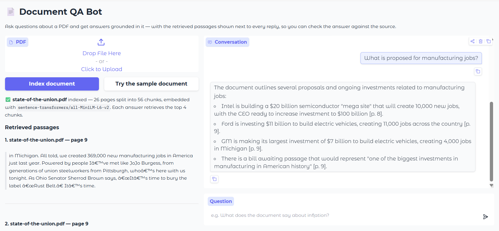

# 📄 Document QA Bot

Ask questions about a PDF and get answers grounded in it — with the passages
behind every answer shown next to the reply, cited down to the page.

Built with LangChain, Google Gemini, and Chroma as the capstone for the IBM AI
Engineering certificate, then extended past the course scope with conversational
retrieval, streaming, and source attribution.



---

## Why the citations matter

The failure mode of a document QA bot is a confident answer that the document
never supported. This one is built so you can check:

- Every answer cites the page it came from, inline — `…a top priority [p. 10].`
- The retrieved chunks are rendered verbatim beside the conversation, so you can
  see exactly what the model was given.
- When retrieval comes back with nothing relevant, the model says
  *"I cannot find the answer in this document"* instead of reaching for what it
  knows about the world.

That last behaviour is enforced by prompt instruction, not by a guarantee.
Retrieval-grounded answers are *checkable*, not automatically correct — which is
the point of showing the sources.

---

## Quickstart

You need Python 3.11+ and a [Google AI Studio API key](https://aistudio.google.com/apikey)
(the free tier is enough).

```bash
git clone https://github.com/YOUR_USERNAME/document-qa-bot.git
cd document-qa-bot

# with uv
uv venv && uv pip install -r requirements.txt

# or with pip
python -m venv .venv && source .venv/bin/activate   # Windows: .venv\Scripts\activate
pip install -r requirements.txt

cp .env.example .env      # then put your key in it
python app.py
```

Open http://127.0.0.1:7860 and click **Try the sample document** to query the
bundled `state-of-the-union.pdf` without uploading anything.

First run downloads the ~90 MB embedding model from Hugging Face; later runs
load it from cache.

---

## How it works

```
PDF ─► PyMuPDF ─► recursive split ─► MiniLM embeddings ─► Chroma (in-memory)
                                                             │
                       question + chat history ──► rewrite ──► retrieve top-4
                                                             │
                                          chunks + question ──► Gemini ──► streamed answer
```

| Stage | Choice | Where |
|---|---|---|
| Parse | PyMuPDF, one document per page | [rag/ingest.py](rag/ingest.py) |
| Split | 1000 chars, 200 overlap, recursive | [rag/ingest.py](rag/ingest.py) |
| Embed | `all-MiniLM-L6-v2`, 384-dim, runs locally | [rag/ingest.py](rag/ingest.py) |
| Index | Chroma, fresh collection per document | [rag/ingest.py](rag/ingest.py) |
| Retrieve | Top 4 by cosine similarity, history-aware | [rag/pipeline.py](rag/pipeline.py) |
| Generate | `gemini-2.5-flash`, temperature 0, streamed | [rag/pipeline.py](rag/pipeline.py) |

On the sample document that comes out to 26 pages → 56 chunks, indexed in about
13 seconds on a laptop CPU.

### Design decisions worth explaining

**Embeddings run locally, generation does not.** The corpus is one document, so
embedding through an API would spend more time on network round-trips than on
compute, and it would send the whole document to a third party. Gemini is used
where it earns its keep — synthesis. The tradeoff is that MiniLM is a weaker
retriever than a large hosted embedding model, which is the cap on quality here.

**Follow-up questions are rewritten before retrieval.** "What is proposed to
lower it?" is meaningless to a similarity search. A first LLM call folds the
conversation into a standalone question, which is then what gets embedded and
matched. This costs an extra call per turn and is why chat history works at all —
see `create_history_aware_retriever` in [rag/pipeline.py](rag/pipeline.py).

**Retrieved chunks carry their page number into the prompt.** Each chunk is
formatted as `[source, p. N]` before being stuffed into context, which is what
gives the model something real to cite. Metadata is trimmed at load time to just
source and page — PyMuPDF otherwise attaches a dozen fields that would be
embedded into every prompt.

**No global state.** The vector store lives in per-session `gr.State`, in memory,
under a fresh collection name per upload. Two people using one running instance
cannot see each other's documents, and re-uploading replaces the knowledge base
rather than merging into a stale one.

---

## Known limitations

- **Text-only.** Tables lose their structure and images are ignored. A scanned
  PDF has no extractable text and is rejected with a message saying so; it would
  need an OCR pass first.
- **In-memory index.** Restarting the app means re-indexing. Fine for a
  single-document demo, wrong for a corpus you query repeatedly.
- **Pure similarity retrieval.** No reranking, no hybrid keyword search, no query
  expansion. Questions phrased very differently from the source wording will miss.
- **Unmeasured.** There is no eval set, so "it answers well" is an impression
  from manual testing, not a number. Retrieval hit-rate and answer accuracy are
  the obvious next thing to build.
- **Single document at a time.** Uploading a second PDF replaces the first.

---

## Project layout

```
app.py              Gradio UI — upload, chat, streaming, sources panel
rag/
  config.py         Settings, env-overridable; API key resolution
  ingest.py         PDF → pages → chunks → Chroma index
  pipeline.py       History-aware retrieval + streaming answers with citations
requirements.txt    Direct dependencies (pyproject.toml is canonical)
state-of-the-union.pdf   Sample document
```

Pipeline behaviour is tunable without touching code — `CHUNK_SIZE`,
`CHUNK_OVERLAP`, `RETRIEVAL_K`, `CHAT_MODEL`, and `EMBEDDING_MODEL` are all read
from the environment. See `.env.example`.
